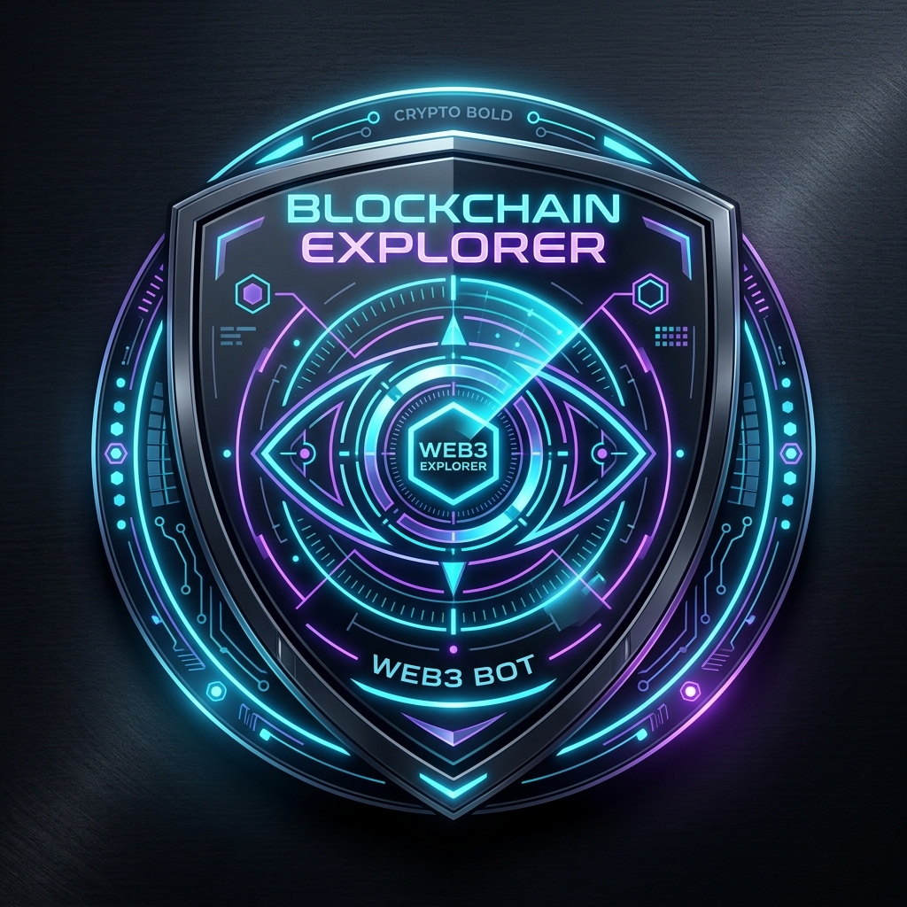

# ⚡ EXPLORER BOT

<p align="center">
  
</p>

<p align="center">
  <strong>Next-Gen On-Chain Wallet Intelligence, Drainer Defense Radar & "On-Chain Wrapped" on Bohr Network</strong>
</p>

<p align="center">
  <a href="https://scan.bohr.life/address/0x01784C6fcE7E1fB40E9E54E449C0c5AcF9946Fe1#code"></a>
  <a href="https://rpc.bohr.life"></a>
  <a href="https://scan.bohr.life"></a>
</p>

---

## 🌟 What is Explorer Bot?

Free block explorers provide raw cryptographic ledger entries. **Explorer Bot** turns on-chain data into **actionable intelligence, drainer defense, and viral social status**.

Users connect their Web3 wallet and pay **0.1 BOT** to unlock a deep dossier featuring their 0–100 Security Health Score, active token approval drainer risks with a 1-click revoke assistant, worst-case exploit loss simulations, and a Spotify-style "On-Chain Wrapped" card.

---

## 🚀 Live Bohr Testnet Deployment

| Parameter | Value |
| :--- | :--- |
| **Contract Name** | `ExplorerPayment` |
| **Contract Address** | [`0x01784C6fcE7E1fB40E9E54E449C0c5AcF9946Fe1`](https://scan.bohr.life/address/0x01784C6fcE7E1fB40E9E54E449C0c5AcF9946Fe1#code) |
| **Verification Status** | ✅ **100% Verified on BohrScan** (`v0.8.20+commit.a1b79de6`, 200 runs) |
| **Network Name** | Bohr Testnet |
| **Chain ID** | `968` |
| **RPC Endpoint** | `https://rpc.bohr.life` |
| **Native Currency** | `BOT` (18 Decimals) |
| **Scan Fee** | `0.1 BOT` |
| **Block Explorer** | [https://scan.bohr.life/](https://scan.bohr.life/) |

---

## 🛡️ Core Feature Matrix

### 1. 🔍 100% Real Live On-Chain Intelligence Scanner
- **Live RPC Balance & Transaction Nonces**: Direct integration with Bohr RPC and BohrScan API (`https://scan.bohr.life/api/v2`).
- **Exact Genesis Origin & Age**: Uncovers first on-chain transaction hash, genesis timestamp, and founding funder address.
- **Lifetime Gas Sacrificed**: Total native BOT gas fees burned converted into USD fiat valuation.
- **Real Token Holdings**: Fetches live ERC-20 token balances (e.g. USDT, MDOGE) with logos and decimals.

### 2. ⚡ Live 1-Click On-Chain Token Revoke Tool
- Directly triggers an ERC-20 `token.approve(spender, 0)` transaction on Bohr Testnet.
- Eliminates third-party drainer risk with one click.

### 3. 📉 Worst-Case Drain Risk Simulator
- Dynamically estimates the maximum dollar ($) loss exposure if approved third-party router contracts were compromised.
- Shows how 1-click revoking reduces theoretical drain risk to **$0.00 (100% Protected)**.

### 4. 👑 "On-Chain Wrapped" & Viral Social Cards
- Computes automated DeFi persona titles: *Bohr Pioneer*, *Gas Contributor*, *Ecosystem Whale*, *Diamond Hands*.
- **1-Click High-Res PNG Generator**: Downloadable infographic card with direct Twitter / X and Telegram share shortcuts.

### 5. ⚔️ Wallet VS Wallet (Degen Battle Mode)
- Compare two Bohr wallets side-by-side (Gas Burned, Portfolio Value, Genesis Age, Health Score).
- Generates a split-screen versus card ready for social sharing.

### 6. 🏆 Bohr Ecosystem Leaderboard
- Real-time ranking of top wallets on Bohr Testnet by **Native BOT Balance**, **Lifetime Gas Burned**, and **Genesis Age**.
- Direct 1-click "Audit" button on any row.

### 7. 🤖 24/7 Telegram & Threat Alerts
- Configure `@telegram_handle` to receive notifications on unauthorized token allowances, large transfers (> 5 BOT), and phishing airdrops.

---

## 📁 Repository Structure

```
explorer bot/
├── contracts/                          # Hardhat Solidity Workspace
│   ├── contracts/
│   │   ├── ExplorerPayment.sol         # Main 0.1 BOT pay-per-scan contract
│   │   └── ExplorerPayment_Flattened.sol # Verified flattened source
│   ├── scripts/
│   │   └── deploy.js                  # Deployment script for Bohr Testnet
│   ├── test/
│   │   └── ExplorerPayment.test.js     # 5/5 Passing Hardhat unit tests
│   ├── hardhat.config.js              # Bohr Network configuration
│   └── package.json
│
└── frontend/                           # Next.js 14 App Router (TypeScript + Tailwind)
    ├── public/
    │   ├── logo.png                   # Cybernetic Radar Logo
    │   └── icon.png
    ├── src/
    │   ├── app/
    │   │   ├── layout.tsx             # Root layout with Web3 provider & metadata
    │   │   ├── page.tsx               # Main Dashboard with Explorer, Battle & Leaderboard
    │   │   └── globals.css            # Cyber dark glassmorphic styling
    │   ├── components/
    │   │   ├── Navbar.tsx             # Brand header, network badge & connect button
    │   │   ├── HeroSearch.tsx         # Search bar, 1-click self-scan & presets
    │   │   ├── SecurityRadar.tsx      # 0-100 Health Score, Approvals & Revoke triggers
    │   │   ├── DrainSimulator.tsx     # Worst-case exploit risk simulator
    │   │   ├── RevokeModal.tsx        # Live on-chain approve(spender, 0) write flow
    │   │   ├── OnchainWrapped.tsx     # Genesis story, gas milestones & badges
    │   │   ├── ShareableCard.tsx      # High-res PNG exportable social card
    │   │   ├── PortfolioMatrix.tsx    # Token balances, dust filter & NFT showroom
    │   │   ├── WalletBattle.tsx       # Side-by-side wallet versus battle
    │   │   ├── Leaderboard.tsx        # Real live Bohr ecosystem rankings
    │   │   ├── TelegramAlertsModal.tsx# 24/7 wallet threat monitoring setup
    │   │   ├── ScanAnimation.tsx      # High-tech cyberpunk radar overlay
    │   │   └── PaywallModal.tsx       # 0.1 BOT payment & free demo preview
    │   ├── config/
    │   │   ├── chains.ts              # Bohr Testnet definition (Chain ID 968)
    │   │   └── appkit.ts              # Reown AppKit + Wagmi setup
    │   ├── context/
    │   │   └── Web3Provider.tsx       # QueryClient + Wagmi provider
    │   ├── services/
    │   │   └── bohrScanner.ts         # Live Bohr RPC & BohrScan API data parser
    │   └── types/
    │       └── scanner.ts             # TypeScript definitions
    ├── tailwind.config.ts
    ├── tsconfig.json
    └── package.json
```

---

## 🛠️ Quickstart Guide

### 1. Smart Contracts
```bash
cd contracts

# Install dependencies
npm install

# Run unit tests
npx hardhat test

# Deploy to Bohr Testnet
npx hardhat run scripts/deploy.js --network bohrTestnet
```

### 2. Frontend Application
```bash
cd frontend

# Install dependencies
npm install

# Start development server
npm run dev
```

Open **[http://localhost:3000](http://localhost:3000)** in your browser.

---

## 🔒 Security & Privacy
- Sensitive private keys in `.env` and `.env.local` are strictly excluded via `.gitignore`.
- Safe template examples are provided in `contracts/.env.example` and `frontend/.env.example`.

---

## 📜 License
MIT License. Built for the **Bohr Network** ecosystem.
